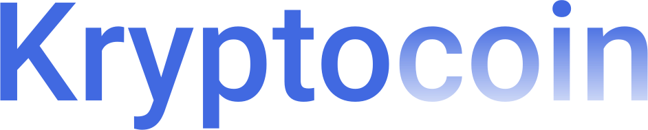

<h1 align="center">
   
</h1>

<h1 align="center">
   
</h1>

# Kryptocoin

Crypto Price Tracker App Developed with <code>React Native</code>, <code>Recoil</code>,<code>ContextAPI</code>, <code>Axios</code>, <code>Coin Gecko API</code>
  

## About the project and how it works

  Kryptocoin tell us about cryptocurrency prices, very similar to the application available on the market `coinMakertCap`, The API used was Coin Gecko. On the home are shown several cryptocurrencies and their respective details such as name, price, market value, etc. By clicking on any of them, you are directed to more specific details of that currency, in addition to the name and value, we also have an animated and minimalistic chart (rainbow-me/react-native-animated-charts library) showing price variations in 24h, 7d intervals , 30d and 1 year.

   
## Portfolio Screen

On the portfolio screen, the user is able to track their cryptocurrencies that have been "bought" and how they are performing, check balance,  <code>add and delete new assets</code>. Concepts like  <code>Navigation</code> ,<code>Fetching data with Axios</code>, <code>Bottom Navigation Menu</code> ,<code>Context API</code>  ,<code>Recoil</code>   , <code>React Memo</code>and <code>Async Storage</code> were implemented.

   
## WatchList Screen

On the WatchList screen the user can favorite desired cryptocurrencies.
To have access to the data on this screen without having to pass it as props,<code>ContextAPI</code> was used. Roughly speaking, the Context API provides a way to pass data from components without having to manually pass through every level. That being said,  The WatchListProvider function returns the created context, which was named as WatchListContext, something like WatchListContext.Provider.
  Everything that is rendered in this provider is called childreen, then we ensure that `WatchListProvider`  is parent of all components thus rendering all childreen, which in this case is the entire application. That way we can use the "provider data" that was defined in the value of the WatchListContext without having to pass as props from the top to the lowest level component. As said, the <code> WatchListContext.Provider</code> needs to be a parent of the entire application, so in the <code>App.js component</code>  and we ensure that all other components, with the exception of the navigationContainer, are children of the WatchListContext. To access the data in any component, the <code>AuseWatchList Hook was created</code>  , which simplifies some steps, imports, etc. That way, just call  <code>useWatchList()</code>  which will have access to the data.

   
   

## Getting started

1. Clone this repo using `git@github.com:eulazzo/kryptocoin.git`
2. Move yourself to the appropriate directory: `cd kryptcoin` 
3. Run `npm install` to install dependencies 
4- Run `yarn run dev` to start up the app  

 
## License

This project is licensed under the MIT License - see the [LICENSE](https://opensource.org/licenses/MIT) page for details.
<!-- <h4>Techs:</h4>

  

  -->

 

 
 

